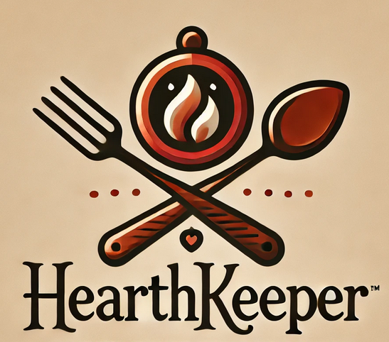

# Hearth Keeper

## Introduction

Hearth Keeper is a recipe website that has been created to what I would like to see in a resipe site. I think a recipe site should be somewhere not only to share your recipes but also to share experiences on cooking others resipes and how they adapted it to their liking. Hearth Keeper has been developed as part of the Code Institute's Full-Stack Developer course as my final project - focusing on Django and Bootstrap frameworks, Database manipulation and CRUD functionality.

View live site here : [Hearth Keeper ADD THIS]()  
  
For Admin access with relevant sign-in information: [Hearth Keeper Admin ADD This]()

## Table of Contents

- [Hearth Keeper](#Hearth-Keeper)
  - [Introduction](#introduction)
  - [Table of Contents](#table-of-contents)
  - [Overview](#overview)
- [UX - User Experience](#ux---user-experience)
  - [Design Inspiration](#design-inspiration)
    - [Colour Scheme](#colour-scheme)
    - [Font](#font)
- [Project Planning](#project-planning)
  - [Strategy Plane](#strategy-plane)
    - [Site Goals](#site-goals)
  - [Agile Methodologies - Project Management](#agile-methodologies---project-management)
    - [MoSCoW Prioritization](#moscow-prioritization)
    - [Sprints](#sprints)
  - [User Stories](#user-stories)
    - [Visitor User Stories](#visitor-user-stories)
    - [Epic - User Profile](#epic---user-profile)
    - [Epic - Articles](#epic---articles)
    - [Epic - Booking](#epic---booking)
    - [Epic - Photo Gallery](#epic---photo-gallery)
    - [Epic - Visit Us/Reviews](#epic---visit-usreviews)
  - [Scope Plane](#scope-plane)
  - [Structural Plane](#structural-plane)
  - [Skeleton \& Surface Planes](#skeleton--surface-planes)
    - [Wireframes](#wireframes)
    - [Database Schema - Entity Relationship Diagram](#database-schema---entity-relationship-diagram)
    - [Security](#security)
- [Features](#features)
  - [User View - Registered/Unregistered](#user-view---registeredunregistered)
  - [CRUD Functionality](#crud-functionality)
  - [Feature Showcase](#feature-showcase)
  - [Future Features](#future-features)
- [Technologies \& Languages Used](#technologies--languages-used)
  - [Libraries \& Frameworks](#libraries--frameworks)
  - [Tools \& Programs](#tools--programs)
- [Testing](#testing)
- [Deployment](#deployment)
  - [Connecting to GitHub](#connecting-to-github)
  - [Django Project Setup](#django-project-setup)
  - [Cloudinary API](#cloudinary-api)
  - [Elephant SQL](#elephant-sql)
  - [Heroku deployment](#heroku-deployment)
  - [Clone project](#clone-project)
  - [Fork Project](#fork-project)
- [Credits](#credits)
  - [Code](#code)
  - [Media](#media)
    - [Additional reading/tutorials/books/blogs](#additional-readingtutorialsbooksblogs)
  - [Acknowledgements](#acknowledgements)

  ## Overview

Hearth Keeper is an recipe website to save your recipes and more. Users are invited to:

- Join the Hearth Keeper community
- Upload their own recipes.
- Rate recipes.
- Comment on recipes.
- Change grams to cups with ease.
- Alter the recipe depending how many people it should serve.
- Add their favourite recipes to their Cookbook
- Try the BETA version to upload recipes from a cookbook by image.

Hearth Keeper is accessible via all browsers and is full responsiveness to fit different screen sizes. Its aim is to create a community for people who love to cook and who want to try new and exciting recipes. 
I wanted to create a site that is built for a community and not just to lookup recipes. A site where people can comunicate via the comments, added suggestion or suggest how this can be prepared for people with certain allergys or preferences. I created this site as I love to cook and following recipes can be hard when you have to convert them from cups to grams and vice versa. I also have noticed that many recipes are made to serve 2 - 4 people, people who live alone or have bigger familes my stay away from these recipes due to the size and not wanting to waste ingredients on attepting to reduce or expand the recipe to suit their needs. I have made this site so it will do these calculations for you so a recipe will be available to anyone without worry. 
I hope to offer users their own profile pages where they can set their favourite recipes with links. 

# UX - User Experience

## Design Inspiration

I was really excited to get working on this project as it is something that I wished all recipe sites had. I wanted to create a website that anyone can use, for people who are neuro-spicy (neurodiverse) I want to keep the website clean, open and straight to the point. A few webistes I have seen go into so much detail about how the recipe came to be and about the site it's self. This is when the recipe gets lost in a forrest of paragraphs. The sites are full of useful information but I feel the extra information should be linked to the page rather than being forced on the user. This is one of the main reason I wanted to create this website. I also want to make it easier for the user to change the recipes from cups to grams and vice versa. I also wanted to take the hassle out of changing a recipe for more or less servings, letting the website calculate this for you.
For my colours I used ChatGPT to create a logo that I liked. I am using the colours from the logo and other that completemnt . For my   Once I had chosen the font of 'Outfit' and created the logo on Procreate, the website content followed swiftly and I had great fun developing it.

  
*Hearth Keeper logo* 

### Colour Scheme

As mentioned above, the main colours I used in my colour scheme came from the logo that I made using ChatGPT. I wanted to create a welcoming and easy to use environment for the user. The colours stay mainly the same through out the website, this is to provide the users with an easy to use website and allow neuro-spicy (neurodiverse) people to feel safe while using the site. I wanted to go with an almost antique feel.

The corresponding sections and colours and identifying CSS variables are:

-
-

  
*Black, white and grey used for backgrounds, text and Login/Logout icon*

  
*Colour Scheme for FreeFido website*

  
*Accessibility check for colour scheme*

### Font

Using [Google Fonts](https://fonts.google.com/), I imported 'this ' and 'that' as a complementary font to my CSS file. 

In development, 'this' was used as my main font for all titles, whilst 'That' was set as my main font for the rest of the site.

# Project Planning  
 
## Strategy Plane

My project goal was to build a simple recipe website with additional features that I feel in this day and age are nessasery. The main goal was to allow users to add and edit their recipes and comments on the site while also allowing them to also delete any unwanted recipes or comments they created. To bring the site into the 21st centurany I wanted to allow users to change the weight metrics to allow anyone in the world to make the recipe. Also allowing the user to change how many people the recipe should cater for, then updating the recipe using this information.  

### Site Goals

- Create a safe and wlcoming environment for people who love to cook.
- Create an easy to use and wlcoming environment for people who want to try new recipes.
- Make it an easy expeiance to convert weight metric for all recipes.
- Let users to set how many servings they need and the recipe to update.
- Allow users to add recipes and comments to the site.
- Users have their own cookbooks to store their favourite recipes.
- UX will remain the same on all devices.
- Addition of future features to help grow the website into a comunity.

## Agile Methodologies - Project Management

Before starting work on Hearth Keeper I used my [Github Projects Board ADD THIS]() to plan and document all of my work.

### MoSCoW Prioritization

I chose to follow the MoSCoW Prioritization method for Hearth Keeper, identifying and labelling my:

- **Must Haves**: the 'required', critical components of the project. Completing my 'Must Haves' helped me to reach the MVP (Minimum Viable Product) for this project early.
  
- **Should Haves**: the components that are valuable to the project but not absolutely 'vital' at the MVP stage. The 'Must Haves' must receive priority over the 'Should Haves'.

- **Could Haves**: these are the features that are a 'bonus' to the project, it would be nice to have them in this phase, but only if the most important issues have been completed first and time allows.

- **Won't Haves**: the features or components that either no longer fit the project's brief or are of very low priority for this release. Also I will use this tags for any future features I wish to add to my project at a later date.

### Sprints

I broke my process into User Stories and Testing Tasks, which I converted into issues and labelled fully on my projects board. [Github Projects Board ADD THIS]()

## User Stories

All of my user stories can be seen on my [Github Projects Board ADD THIS](). They were all made before I started my project and managed throughout the development. 

## Scope Plane

As this would not only be the building of my final project but also a learning experiance using new API's and covering many to many databases. I have built this website in using technologies I didn't know exsisted before I started this 16 week Full Stack Course. These technologies include Django, Bootstrap and Cloudinary. I follwed my agile planning and my user stories to help me keep on track and not fall into the many "what if I add..." sinarions. I did however write these down on paper with the forsite of adding these as my future fatures. I added my User Stories and Testing Tasks as issues on my [Github Projects Board ADD THIS]().

Essential features of my project were:

- A Responsive website for all device sizes 
- User Authentication
- Recipe feature with full CRUD functionality
- Comments feature with full CRUD functionality

I planned my project thoroughly as this has been something I have wanted to use for a long time. No other site I have used previously have lived upto my expectations of what a recipe site in 2024 should offer. 

## Structural Plane

  
*Navigation icons for FreeFido*  

  
*Sign Up page header*  

## Skeleton & Surface Planes

### Wireframes

The wireframes for Hearth Keeper were created in Figma. [Figma](www.figma.com) is an easy and fast design system that is a cloud-based design tool. It is easy to make user interface (UI) and user experience (UX) design projects. It’s a vector graphics editor that allows designers and developers to create, prototype, and test digital products such as websites, mobile apps, and software interfaces.

**Mobile/Tablet view for:**  

- Home
- Recipes
- My Cookbook

I wanted an easy to use website, that has a welcoming feel to all users.

    
Mobile/Tablet Home Page Wireframe
  
      

    
Mobile/Tablet recipe Page Wireframe
  
    

    
Mobile/Tablet My Cookbook Page Wireframe
  
    

**Desktop view for:**

- Home
- Recipes
- My Cookbook

    
Desktop Home Page Wireframe
  
      

    
Desktop Recipes Page Wireframe
  
    

    
Desktop My Cookbook Page Wireframe
  
    

### Database Schema - Entity Relationship Diagram

  
*Database Schema (ERD) for Hearth Keeper displaying relationships between components within the database*

This Entity Relationship Diagram(ERD) demonstrates how each feature interacts with each other and the connected PostgreSQL Database. Using Django's User Model, and Django AllAuth to carry out all user authentication, a user_id is created when the user registers with their username and email. This allows the user create profile which is used to long into the site, create new recipes, add comments and photos to recipes, rate the recipes and create and manage their own My Cookbook which contains their favourite recipes.

The Comments Model were inspired by the blog walkthrough by the Code Institute. This takes the username of the user via the user_Id as a forigenkey and lets them leave a comment on a recipe via the recipe_id that will require the admin to review and approve. 

Recipes Model collects data from the user. The title, ingredience and method and the serving amount. This takes the username of the user via the user_Id as a forigenkey

Through the Admin Django Dashboard the super user will have access to approve or delete recipes and comments from all users. The super user can also delete the the user and all the data that user has added to the site.

### Security

**AllAuth**  

Django AllAuth is an installable framework that takes care of the user registration and authentication process. Authentication was needed to determine when a user was registered or unregistered and it controlled what content was accessible on FreeFido. The setup of AllAuth included:

- installing it to my workspace dependencies
- adding it to my INSTALLED_APPS in my settings.py
- sourcing the AUTHENTICATION_BACKENDS from the AllAuth docs for my settings.py
- adding its URL to my projects 'urls.py'
- run database migrations to create the tables needed for AllAuth
- (For this version of FreeFido, to meet MVP, email and social accounts were not configured as part of the feedback/sign up options to the user. They will be included with the next release.)
  
**Defensive Design**  

FreeFido was developed to ensure a smooth user experience, to the best of my current learning experience with Django. 

- Input validation and error messages provide feedback to the user to guide them towards the desired outcome. 
- Unregistered users are diverted to the Sign Up page from restricted access pages. 
- Authentication processes control edit/delete icons to reveal them to the content author only. 
- Deletion of data is confirmed through an additional modal, double-checking with the user.
- Error pages are displayed with 'Take me home' buttons to help users get back on track. 
- Testing and validation of features completes the process.

**CSRF Tokens** 

CSRF (Cross-Site Request Forgery) tokens are included in every form to help authenticate the request with the server when the form is submitted. Absence of these tokens can leave a site vulnerable to attackers who may steal a users data.
  